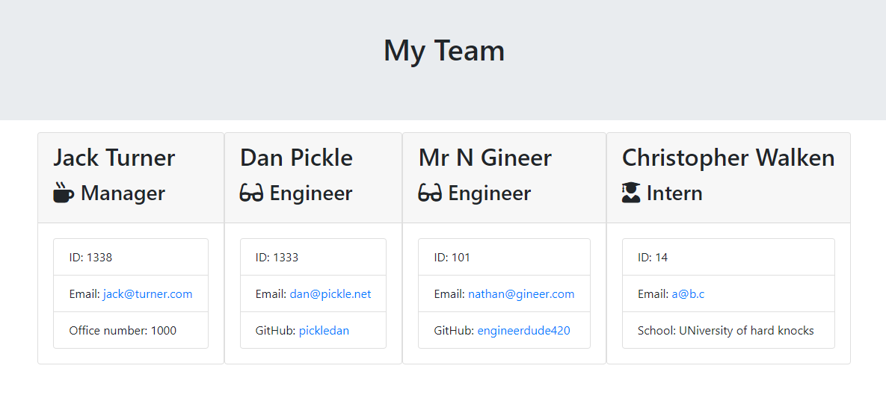

# Team Profile Generator 


## Description 
This application was created to demonstrate use of OOP and TDD using Jest. It will generate a team profile based on user input using the Inquirer module and render the results to a new html page.
 
## Table of Contents
* [Installation](#installation)
* [Usage](#usage)
* [License](#license)
* [Contributing](#contributing)
* [Tests](#tests)
* [Questions](#questions)

## Installation 
Simply clone the repository and make sure you have node installed. Requires file system (fs) and inquirer modules. If testing is required, this application uses Jest. Here is an example of how to install the required packages

```
git clone git@github.com:Jack-educational/team-profile-generator.git
npm install fs
npm install inquirer
npm install jest
```

## Usage 
Use inquirer from your command line to answer questions about your project. Example output: <br>


## License 
This project is license under MIT

## Contributing 
Contributors should read the installation section. 

## Tests
Run `npm test` to run Jest for tests on constructors. 

## Questions
If you have any questions about this projects, please contact me directly on the email address in my profile. You can view more of my projects at https://github.com/neverekt
